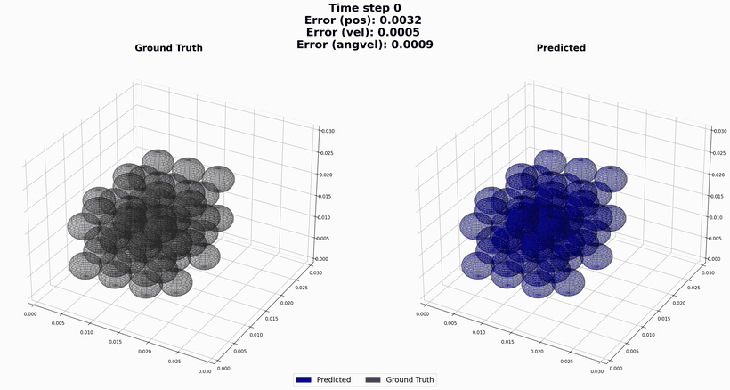
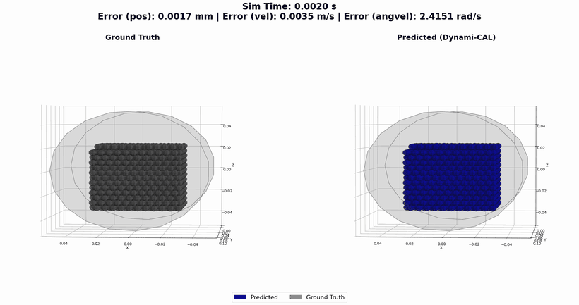
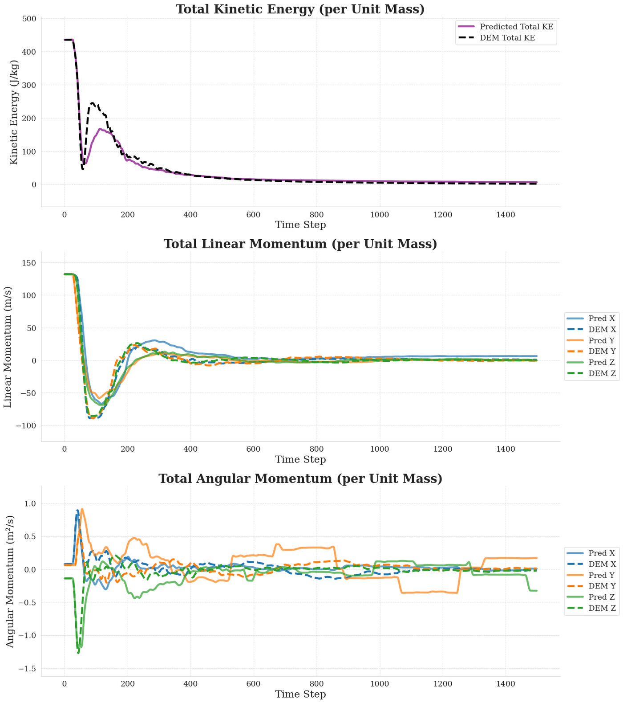
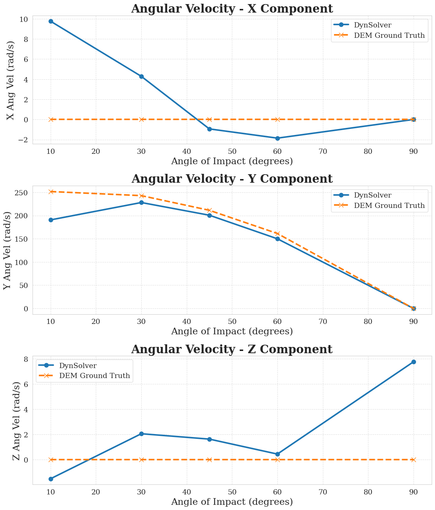
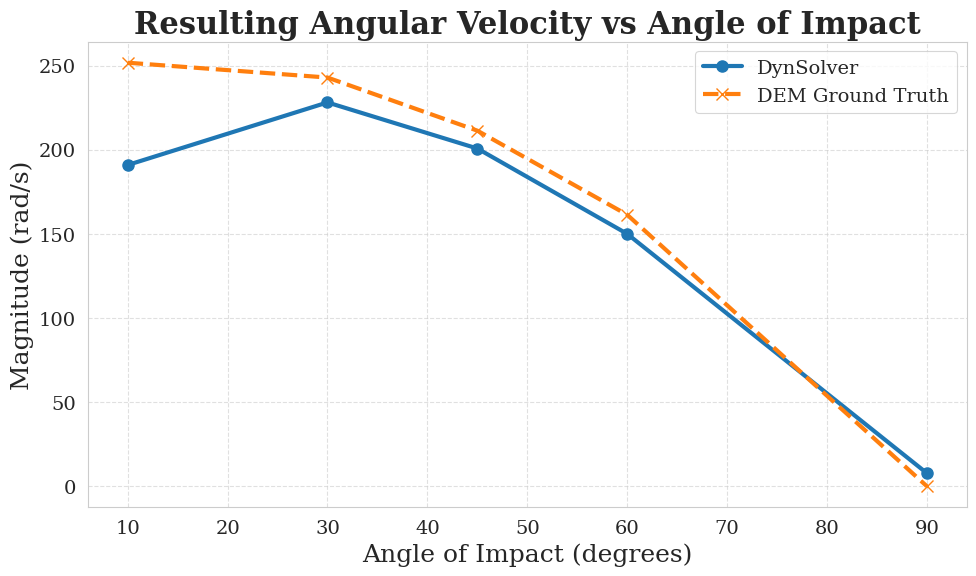
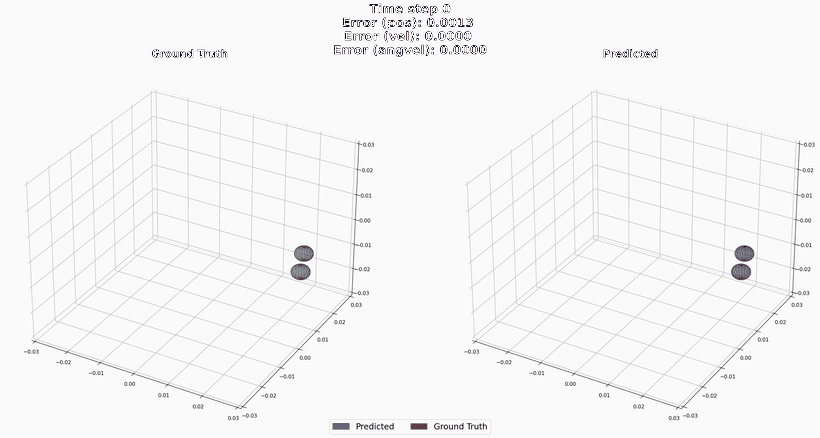
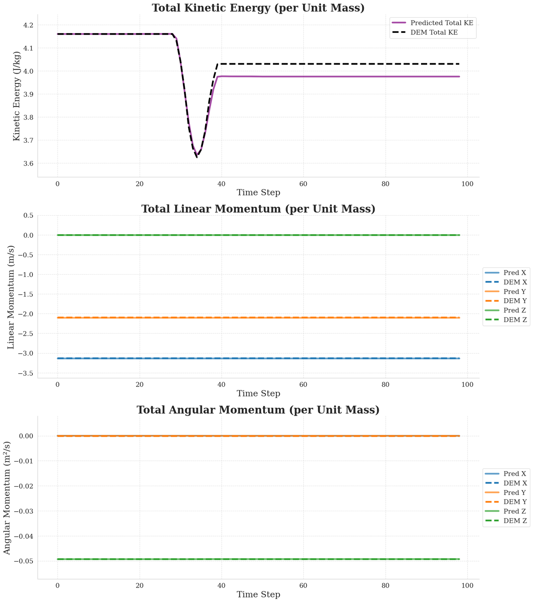
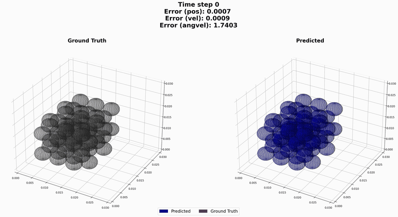
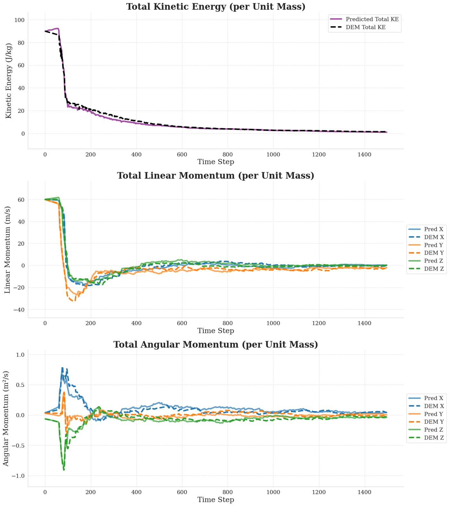

# Dynami-CAL GraphNet: Discrete Element Method

PyTorch implementation of the granular-mechanics experiments for:

> **A physics-informed graph neural network conserving linear and angular momentum for dynamical systems**
> Vinay Sharma and Olga Fink, *Nature Communications*, 2026
> [10.1038/s41467-025-67802-5](https://www.nature.com/articles/s41467-025-67802-5)

The network predicts pairwise contact impulses between rigid spheres. Linear and angular
momentum are conserved by construction, not by a penalty term: each contact carries a local
frame that flips under exchange of its two endpoints, so the impulse the sender receives is
exactly the negative of the receiver's, for any parameter values.

This repository covers the two 3D Discrete Element Method (DEM) cases. The human motion and
N-body experiments live in the main repository.

<p align="center">
  
  
</p>
<p align="center">
  <em>Left: 60 spheres in a sealed cuboid, 1499 predicted steps. Right: zero-shot
  extrapolation to a 2,073-sphere rotating drum, a geometry never seen in training.</em>
</p>

---

## Contents

- [Quick start](#quick-start)
- [Installation](#installation)
- [Step 1: Download the data](#step-1-download-the-data)
- [Step 2: Build the graphs](#step-2-build-the-graphs)
- [Boundary model](#boundary-model)
- [Step 3: Case 04, homogeneous spheres](#step-3-case-04-homogeneous-spheres)
- [Step 4: Case 05, gravity and a rotating drum](#step-4-case-05-gravity-and-a-rotating-drum)
- [Results](#results)
- [Metrics](#metrics)
- [Repository layout](#repository-layout)
- [Known limitations](#known-limitations)
- [Citation](#citation)

---

## Quick start

Trained checkpoints ship with the repository, so you can reproduce every figure below without
training anything.

```bash
conda env create -f environment.yml
conda activate dem-dyngnet

python case_04_dem_simple/get_data.py        # ~4 GB from Zenodo
python case_04_dem_simple/preprocess.py      # ~12 min
python main_dem_simple.py --mode test --plot --save_data
```

Outputs land in `case_04_dem_simple/results/case_07_rollout/`.

---

## Installation

Requires Python 3.12 and, for training, an NVIDIA GPU. Everything was verified end to end on
Linux with an RTX 2080 Ti and on macOS with CPU only.

**Conda**

```bash
conda env create -f environment.yml
conda activate dem-dyngnet
```

**pip**

```bash
python -m venv .venv && source .venv/bin/activate
pip install -r requirements.txt
```

| Package | Version |
| --- | --- |
| Python | 3.12 |
| torch | 2.7.0 |
| torch-geometric | 2.6.1 |
| numpy | 1.26.4 |
| pandas | 2.2.2 |
| matplotlib | 3.9.2 |
| seaborn | 0.13.2 |
| imageio | 2.33.1 |
| tqdm | 4.66.5 |

Confirm the GPU is visible before starting a long run:

```bash
python -c "import torch; print(torch.__version__, torch.cuda.is_available())"
```

Three notes on the environment:

- **PyTorch 2.6 or newer is required.** Preprocessed graphs are PyTorch Geometric `Data`
  objects loaded with `weights_only=False`, an argument that only exists from 2.6 onward.
- **The compiled PyG extensions are not needed.** Only `Data` and `DataLoader` are used, so
  `torch-scatter`, `torch-sparse` and `torch-cluster` can be skipped.
- **No separate CUDA step.** The default PyPI wheel for `linux-x86_64` is already the CUDA
  build. Use `--index-url` only to pin a different CUDA version or force a CPU-only build.

Install through pip rather than conda for numpy and matplotlib. Mixing conda-forge numpy with
the pip PyTorch wheel puts two OpenMP runtimes in one process, which aborts the interpreter on
import in an order-dependent way.

---

## Step 1: Download the data

Simulation data is hosted on Zenodo at
[10.5281/zenodo.19691595](https://zenodo.org/records/19691595) and is fetched automatically:

```bash
python case_04_dem_simple/get_data.py
python case_05_dem_hard/get_data.py
```

Both scripts resume, skip files already present, and delete the `.zip` archives after
extraction. Case 05 accepts `--keep-zip` to retain them.

<details>
<summary>Directory layout produced</summary>

```
case_04_dem_simple/data/homogeneous/
├── training/        case_01 … case_05      60 spheres, sealed cuboid
├── validation/      case_06
├── extrapolation/   case_07                held out
└── benchmark/
    ├── oblique_wall_collisions/    10, 30, 45, 60, 90 degrees
    └── oblique_sphere_collisions/  two spheres in free space

case_05_dem_hard/data/heterogeneous/gravity/
├── training/          case_01 … case_05    60 spheres under gravity
├── validation/        case_06
├── extrapolation/     case_07
└── rotating_cylinder/ 2,073 spheres in a rotating drum
```

</details>

---

## Step 2: Build the graphs

```bash
python case_04_dem_simple/preprocess.py     # ~12 min
python case_05_dem_hard/preprocess.py       # ~25 min, cylinder dominates
```

Each frame becomes one graph. Nodes are the spheres plus one ghost node per wall per sphere;
edges connect pairs within 1.25 sphere diameters. A sliding (t−1, t, t+1) window drops the
first and last frame, so a 1501-frame simulation yields 1499 graphs.

| Split | Graphs |
| --- | --- |
| Cuboid cases (`case_01` … `case_07`), both cases | 1499 each |
| `oblique_sphere_collisions` | 99 |
| `oblique_wall_collisions/{10,30,45,60,90}_deg` | 199 each |
| `rotating_cylinder` | 1999, 8,292 nodes each |

Budget about 3 GB for the two `dataset/` directories.

> **Rebuild the graphs whenever `boundary_model.py` changes.** The graphs on disk encode the
> boundary construction, and training reads them while evaluation rebuilds graphs live. A
> stale `dataset/` therefore trains on one thing and scores on another, with no error raised.

---

## Boundary model

Walls are represented by ghost nodes rather than by a force law. Each sphere is reflected
across every wall to create one ghost per surface, and a wall contact is an ordinary
sphere-sphere contact with that ghost.

- **Placement.** A ghost sits at a distance |d| beyond its wall, where d is the signed
  distance from the sphere centre to the plane, measured along the outward normal n. The
  sphere-to-ghost separation is 2|d|, so a contact registers when that falls under the
  interaction threshold, exactly as it would between two real spheres.

```
              inside    |    outside              d     = (p - p_wall) . n     (negative inside)
                        |                         ghost = p + 2|d| n
                        |         n --->
           (p)          |          (ghost)        contact when 2|d| < threshold
            O-----------|-----------O
            '--- |d| ---'--- |d| ---'
            '-------- 2|d| ---------'
                        |
                   wall plane
```

  The absolute value is what keeps the ghost on the far side. If a sphere ever crosses the
  plane, the signed form `p - 2d n` puts its ghost *inside* the domain, and the contact then
  drives the sphere further out instead of back in.

```
   sphere has crossed the plane
   ---------------------------------------------------------------------------

     signed form   p - 2d n                 absolute form   p + 2|d| n

        (ghost)    |    (p)                              |   (p)      (ghost)
          O--------|-----O                     ----------|----O----------O
                   |     |                               |    |
                   |     '--> pushed OUT                 |    '<-- pushed back IN
              wall plane                            wall plane
```

- **Pairing.** Each ghost bonds only with the sphere it mirrors. Ghost-to-ghost and
  sphere-to-another-sphere's-ghost edges cannot arise.
- **Kinematics.** Ghosts of a stationary wall carry zero velocity, so the relative velocity at
  the contact is the sphere's own. That preserves the tangential component, which is what
  generates spin on an oblique impact. Ghosts are not integrated; they are rebuilt by
  reflection at every step.
- **Cylinder.** The drum has three surfaces, the curved wall and two end caps, so each sphere
  carries three ghosts. When the drum rotates, `rotating_walls()` gives each ghost the local
  surface velocity of the wall it represents.

`case_04_dem_simple/boundary_model.py` implements the cuboid; `case_05_dem_hard/boundary_model.py`
adds the cylinder.

---

## Step 3: Case 04, homogeneous spheres

60 identical spheres in a sealed 0.03 m cuboid, no external forces, timestep 1×10⁻⁴ s.
Hyperparameters live in `case_04_dem_simple/config.py`: Adam, learning rate 3×10⁻⁴, batch 64,
250 epochs, latent width 128, 5 message-passing rounds.

```bash
# Train on cases 01-05, validating on case 06 every 5 epochs
python main_dem_simple.py --mode train

# Autoregressive rollout on the held-out case 07
python main_dem_simple.py --mode test --plot --save_data

# Two spheres colliding obliquely in free space
python main_dem_simple.py --mode benchmark_sphere_collisions --plot

# One sphere striking a wall at 10, 30, 45, 60 and 90 degrees
python main_dem_simple.py --mode benchmark_wall_collisions --plot
```

| Flag | Effect |
| --- | --- |
| `--plot` | Render frames and assemble a GIF |
| `--save_data` | Keep per-step `.pt` snapshots under `results/` for later analysis |
| `--save_plot` | Keep the individual PNG frames after the GIF is built |

Checkpoints are selected on a 200-step rollout of the validation case, scored by the summed
position, velocity and angular-velocity errors.

---

## Step 4: Case 05, gravity and a rotating drum

Adds gravity and a rotating cylindrical boundary. Hyperparameters in
`case_05_dem_hard/config.py`: Adam, learning rate 1×10⁻³, batch 64, 200 epochs, latent width
128, 5 message-passing rounds.

Gravity is one learned scalar: an acceleration along the y axis, applied to every sphere on
each sub-step. The direction is fixed in the model, so only the magnitude is learned.

It is switched by `use_ext_force` in the case config, `True` here and `False` for case 04,
whose cuboid is sealed and has no external field. With it off the head is not built at all,
so nothing outside the contact model can change the system's total momentum. Checkpoints are
tied to the setting they were trained under: a model saved with the head on will not load
with it off, and the reverse.

```bash
python main_dem_hard.py --mode train
python main_dem_hard.py --mode test --plot --save_data       # cuboid, case 06
python main_dem_hard.py --mode cylinder --plot --save_data   # rotating drum
```

**Timestep synchronisation.** The solver integrates at 1×10⁻⁴ s while the cylinder reference
data is stored at 1×10⁻³ s, so the rollout takes 10 internal micro-steps per reference frame.
The ratio is read from `config.py`; for the cuboid modes it is 1.

The cylinder is the expensive run: 1,998 sync points × 10 micro-steps ≈ 20,000 forward passes
over an 8,292-node graph, rebuilt at every micro-step. Expect ~20 minutes on an RTX 2080 Ti.

To re-render saved snapshots without recomputing the physics:

```bash
python case_05_dem_hard/render_frames.py \
    --data_dir case_05_dem_hard/results/rotating_cylinder_rollout/rollout_data \
    --cylinder --frequency 25
```

---

## Results

Produced by the shipped checkpoints. Errors are dimensionless, divided by training-set maxima.

### Case 04: held-out case 07

| Metric | Value |
| --- | --- |
| Position MAE, 1499 steps | 1.615 |
| Velocity MAE | 0.137 |
| Angular velocity MAE | 0.161 |
| Position MAE, first 600 steps | 1.037 |

<p align="center"></p>

### Wall impact: spin generated by an oblique strike

A single sphere strikes a wall at five angles. Spin about the y-axis is the physical response;
x and z should stay at zero.

<p align="center">
  
  
</p>

| Impact angle | 10° | 30° | 45° | 60° | 90° |
| --- | --- | --- | --- | --- | --- |
| Reference (rad/s) | 252 | 243 | 211 | 162 | 0 |
| Predicted (rad/s) | 191 | 228 | 201 | 150 | 0 |

### Sphere–sphere collision

<p align="center">
  
  
</p>

### Case 05: gravity, and zero-shot transfer to the drum

| Rollout | Position MAE | Velocity MAE | Angular velocity MAE | Absolute position error |
| --- | --- | --- | --- | --- |
| Cuboid under gravity, 1498 steps | 0.630 | 0.084 | 0.082 | 3.9 mm |
| Rotating drum, 1998 steps | 0.932 | 0.019 | 0.039 | 5.8 mm |

The drum is a zero-shot transfer: a curved rotating boundary and 35× more spheres than
anything in training. Error stays bounded across 20,000 forward passes rather than growing,
and the bed stays axially centred to within about 2.5 mm of the reference.

<p align="center">
  
  
</p>

---

## Metrics

`evaluate_rollout` returns per-step position, velocity and angular-velocity errors. They are
dimensionless, divided by training-set maxima: `edge_feat_max` for position (6.25×10⁻³ m, the
interaction cutoff rather than the box size), `node_vel_max` for velocity, `node_angvel_max`
for angular velocity. The mean of the three is printed every 5 epochs during training and used
for checkpoint selection.

Case 05 additionally writes absolute errors into each snapshot: `mae_pos` in millimetres,
`mae_vel` in m/s, `mae_ang` in rad/s. These are not the dimensionless values.

Neither pipeline serialises the per-step error sequences. Capture them from the return value of
`evaluate_rollout` if you need them.

---

## Repository layout

```
model/model_dem.py             Network: edge frames, conserved impulses, integration loop
utils/trainer_dem.py           Training loop, gradient accumulation, checkpointing
utils/utils_dem.py             MLP builder

case_04_dem_simple/            Homogeneous spheres in a sealed cuboid
  config.py                    Geometry, hyperparameters, paths
  boundary_model.py            Ghost-node walls, graph construction
  dataset.py  preprocess.py  get_data.py
  rollout_evaluator.py         Autoregressive rollout
  visualization.py             Frames, conservation panels, GIFs

case_05_dem_hard/              Mixed densities under gravity, plus the rotating drum
  boundary_model.py            Cuboid walls and rotating cylinder
  render_frames.py             Re-render saved snapshots
  (otherwise mirrors case_04)

main_dem_simple.py             Entry point, Case 04
main_dem_hard.py               Entry point, Case 05
decisions.md                   Reproduction log: measurements, deviations, defects found
```

---

## Known limitations

Measured, and stated so results are not over-read.

- **A few spheres escape during long rollouts.** The wall barrier is finite: beyond 3.125 mm
  past the plane no wall edge exists, so a sphere fast enough to cross that band in one step is
  never pushed back. Measured pass-through speed is 4.75 m/s against 3.81 m/s initial speed in
  the data. Typically 4 of 60 spheres escape over 1499 steps and then drift in straight lines.
  They carry most of the apparent late-time energy excess; the spheres that remain track the
  reference energy to within about 40%.
- **Spurious spin components on wall impact.** The x and z components should be identically
  zero and instead reach a few rad/s against a y-axis response of 150–230 rad/s.
- **Case 05's `--mode test` evaluates `case_06`**, which is also the validation case used for
  checkpoint selection, so it is not a held-out generalization result. Case 04's `--mode test`
  uses the genuinely held-out `case_07`.
- **Rendering spawns one process per CPU core.** Cap `max_workers` in `rollout_evaluator.py` on
  a machine with many cores and little memory.
- **Single seed.** Runs are seeded with `set_seed(100)`, but no seed-variance study was
  performed, so no error bars accompany these numbers.
- **A missing checkpoint does not stop evaluation.** The pipeline proceeds with random weights
  and still writes plausible-looking GIFs. Confirm the log contains
  `Loaded best validation model from ...` before treating any output as a result.

`decisions.md` records the full reproduction log, including defects found in the original code
and the measurements behind each of the points above.

---

## License

[Non-Commercial License Agreement](LICENSE.txt). Use is granted for academic and other
non-commercial research; downloading or using the Program constitutes acceptance. The licence
does not permit re-using parts of the Program in other programs, and requires that the
copyright headers in the source files are left intact. Redistribution is permitted only for
academic, non-commercial purposes and only with a copy of the licence included.

For commercial licensing, contact [EPFL's Technology Transfer Office](https://tto.epfl.ch/).

Cite as set out in [CITATION.cff](CITATION.cff), which also carries the acknowledgement text
the licence asks for.

---

## Citation

```bibtex
@article{sharma2026dyngnet,
  title   = {A physics-informed graph neural network conserving linear and angular momentum for dynamical systems},
  author  = {Sharma, Vinay and Fink, Olga},
  journal = {Nature Communications},
  year    = {2026},
  doi     = {10.1038/s41467-025-67802-5}
}
```
